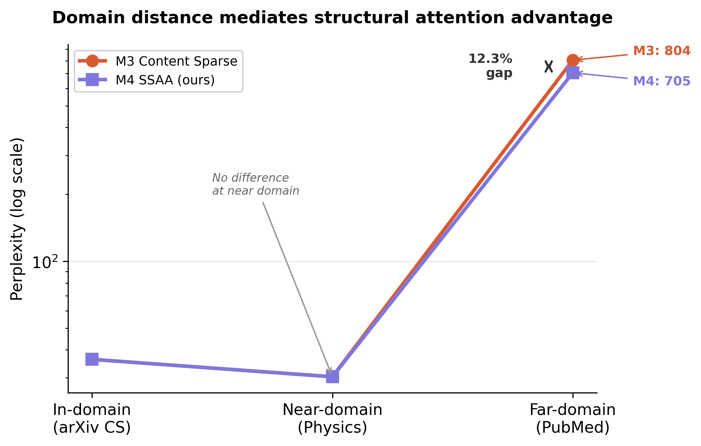
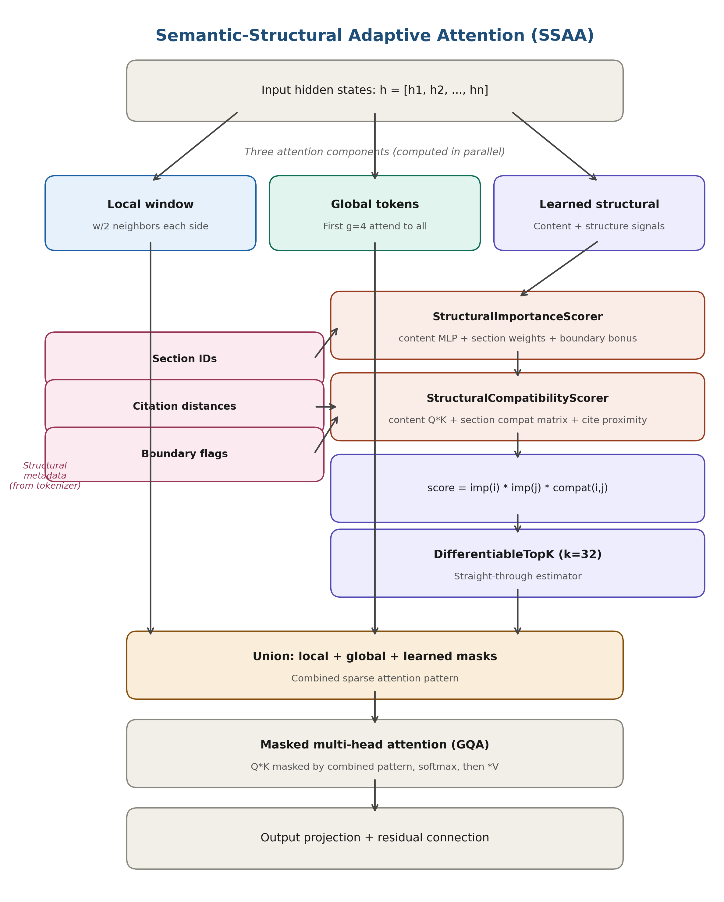
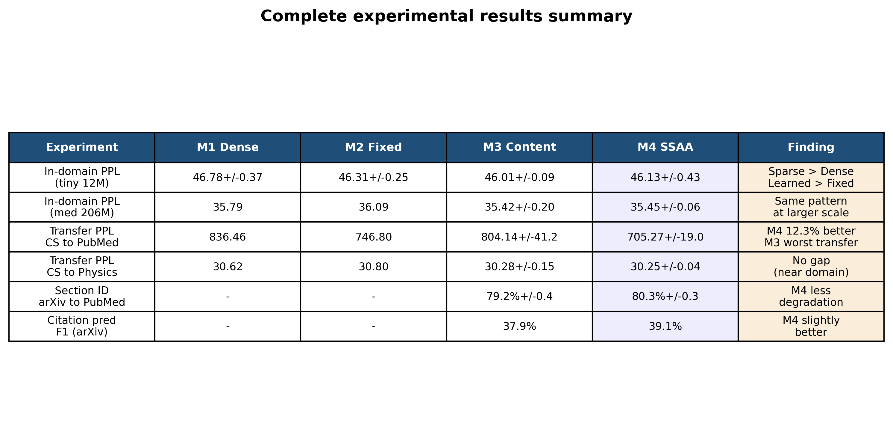

# Structure-Conditioned Sparse Attention for Scientific Document Language Modeling

> Anonymous repository for paper review.

## Overview

This repository contains the implementation and experimental code for **Semantic-Structural Adaptive Attention (SSAA)**, a sparse attention mechanism that conditions learned attention patterns on document structural metadata (section types, citation proximity, boundary flags) for scientific document language modeling.

### Key Finding

Structure-conditioned attention does not improve in-domain perplexity — content signals already capture structural information implicitly. However, it significantly improves **cross-domain transfer**: when models trained on arXiv CS papers are evaluated on PubMed biomedical text, SSAA achieves **12.3% lower perplexity** than content-only attention, with the effect scaling with domain distance.



## Architecture

SSAA combines three attention components into a unified sparse attention mask:

1. **Local window attention** (w=128) — each token attends to nearby neighbors
2. **Global token attention** (g=4) — first tokens attend to all positions  
3. **Learned structural sparse connections** (k=32) — top-k connections selected via importance and compatibility scoring conditioned on structural metadata



## Results

### Cross-Domain Transfer (Medium 206M, 3 seeds)

| Variant | arXiv PPL | PubMed PPL | Physics PPL |
|---------|-----------|------------|-------------|
| M1 (Dense) | 36.69* | 836* | 30.62* |
| M2 (Fixed Sparse) | 36.89* | 747* | 30.80* |
| M3 (Content Sparse) | 36.25 | 804 +/- 41 | 30.28 +/- 0.15 |
| **M4 (SSAA)** | **36.26** | **705 +/- 19** | **30.25 +/- 0.04** |

*\* Single seed due to compute constraints. M3/M4 averaged over 3 seeds.*

### In-Domain Results

| Variant | Tiny (12M) | Medium (206M) |
|---------|-----------|--------------|
| M1 (Dense) | 46.78 +/- 0.37 | 35.79* |
| M2 (Fixed Sparse) | 46.31 +/- 0.25 | 36.09* |
| M3 (Content Sparse) | 46.01 +/- 0.09 | 35.42 +/- 0.20 |
| M4 (SSAA) | 46.13 +/- 0.43 | 35.45 +/- 0.06 |

### Cross-Domain Section Identification (Train arXiv, Test PubMed)

| Variant | arXiv Acc | PubMed Acc | Degradation |
|---------|-----------|------------|-------------|
| M3 (Content) | 93.0% | 79.2% +/- 0.4 | 13.8% |
| **M4 (SSAA)** | **92.4%** | **80.3% +/- 0.3** | **12.2%** |

### Statistical Analysis

| Comparison | t-stat | p-value | Cohen's d |
|---|---|---|---|
| M3 vs M4 (PubMed) | 2.85 | 0.10 | 3.08 (large) |
| M3 vs M4 (Physics) | 0.48 | 0.68 | -- |

*With n=3 seeds, the paired t-test is underpowered, but Cohen's d=3.08 confirms a large effect and M4 outperforms M3 on every individual seed.*



## Repository Structure

```
ssaa-anonymous/
|-- README.md
|-- LICENSE
|-- requirements.txt
|
|-- src/
|   |-- __init__.py          # Package exports
|   |-- model.py             # Decoder-only transformer
|   |                        #   RMSNorm, SwiGLU, GQA, weight-tied embeddings
|   |-- ssaa.py              # Semantic-Structural Adaptive Attention
|   |                        #   StructuralImportanceScorer
|   |                        #   StructuralCompatibilityScorer
|   |                        #   DifferentiableTopK
|   |                        #   SemanticStructuralAdaptiveAttention
|   |-- rsape.py             # Research-Structure-Aware Positional Encoding
|   |                        #   Extends RoPE with section/citation/boundary
|   +-- tokenizer.py         # Custom BPE tokenizer (32K vocab, 10 structural tokens)
|
|-- ablation_study.py        # Main experiment script (prepare/train/evaluate)
|
|-- scripts/
|   +-- download_arxiv.py    # Download arXiv papers via API
|
|-- figures/
|   |-- fig1_ssaa_architecture.pdf
|   |-- fig3_domain_distance.pdf
|   |-- fig4_indomain_ablation.pdf
|   |-- fig5_section_crossdomain.pdf
|   +-- fig6_results_summary.pdf
|
+-- results/
    +-- VERIFIED_FINAL_RESULTS.json
```

## Ablation Variants

| Variant | Attention Type | Learned? | Structure? |
|---------|---------------|----------|------------|
| **M1 (Dense)** | Standard MHA + RoPE, full O(n^2) | No | No |
| **M2 (Fixed Sparse)** | Local window + global tokens | No | No |
| **M3 (Content Sparse)** | Local + global + learned from content | Yes | No |
| **M4 (SSAA)** | Local + global + learned from content + structure | Yes | Yes |

## Model Configurations

| Parameter | Tiny | Medium |
|-----------|------|--------|
| Hidden dimension | 256 | 896 |
| Layers | 4 | 14 |
| Attention heads | 4 | 14 |
| KV heads (GQA) | 2 | 7 |
| FFN dimension | 1,024 | 3,584 |
| Parameters (M1/M2) | 12.1M | 197.3M |
| Parameters (M3/M4) | 12.3M | 205.7M |

## Reproducing Results

### Prerequisites

```bash
# Python 3.10+
pip install torch>=2.0 numpy gdown
```

### Step 1: Download data

The experiments use the [scientific_papers dataset](https://huggingface.co/datasets/armanc/scientific_papers) (Cohan et al., 2018).

```bash
# Download arXiv full-text papers (~3.6GB)
python -c "import gdown; gdown.download('https://drive.google.com/uc?id=1b3rmCSIoh6VhD4HKWjI4HOW-cSwcwbeC', 'data/arxiv_papers.tar.gz', quiet=False)"

# Extract
python -c "
import zipfile
with zipfile.ZipFile('data/arxiv_papers.tar.gz', 'r') as z:
    z.extractall('data/arxiv_raw')
"

# Download PubMed papers (~840MB, for cross-domain evaluation)
python -c "import gdown; gdown.download('https://drive.google.com/uc?id=1lvsqvsFi3W-pE1SqNZI0s8NR9rC1tsja', 'data/pubmed_papers.tar.gz', quiet=False)"

python -c "
import zipfile
with zipfile.ZipFile('data/pubmed_papers.tar.gz', 'r') as z:
    z.extractall('data/pubmed_raw')
"
```

### Step 2: Build structured corpus

```bash
# Creates data/real_structured_corpus.txt (~207K documents)
# with <abstract>, <intro>, <methods>, <results>, <conclusion>, <cite> tags
# parsed from real LaTeX section labels
python -c "
import json, re, random, os
random.seed(42)
section_map = {
    'abstract': '<abstract>', 'introduction': '<intro>',
    'method': '<methods>', 'methods': '<methods>', 'methodology': '<methods>',
    'approach': '<methods>', 'model': '<methods>', 'framework': '<methods>',
    'experiment': '<results>', 'experiments': '<results>', 'evaluation': '<results>',
    'result': '<results>', 'results': '<results>', 'analysis': '<results>',
    'conclusion': '<conclusion>', 'conclusions': '<conclusion>',
    'discussion': '<conclusion>', 'summary': '<conclusion>',
}
def map_section(name):
    for key, tag in section_map.items():
        if key in name.lower(): return tag
    return None
corpus = []
for split in ['train', 'val', 'test']:
    path = f'data/arxiv_raw/arxiv-dataset/{split}.txt'
    if not os.path.exists(path): continue
    with open(path, 'r', encoding='utf-8') as f:
        for line in f:
            try: item = json.loads(line.strip())
            except: continue
            sections = item.get('sections', [])
            sec_names = item.get('section_names', [])
            abstract = item.get('abstract_text', [])
            if len(sections) < 2: continue
            doc = '<abstract> ' + ' '.join(abstract) + ' ' if abstract else ''
            tags_used = set()
            for name, sents in zip(sec_names, sections):
                tag = map_section(name)
                if tag and tag not in tags_used:
                    tags_used.add(tag)
                    text = ' '.join(sents[:20])
                    text = re.sub(r'@xmath\d+', '', text)
                    text = re.sub(r'@xcite', '<cite>', text)
                    text = re.sub(r'\s+', ' ', text).strip()
                    if len(text) > 50: doc += tag + ' ' + text + ' '
            n_tags = sum(1 for t in ['<abstract>','<intro>','<methods>','<results>','<conclusion>'] if t in doc)
            if n_tags >= 2 and len(doc) > 200: corpus.append(doc.strip())
random.shuffle(corpus)
os.makedirs('data', exist_ok=True)
with open('data/real_structured_corpus.txt', 'w', encoding='utf-8') as f:
    for doc in corpus: f.write(doc + '\n')
print(f'Created {len(corpus)} structured documents')
"
```

### Step 3: Train tokenizer and prepare data

```bash
python scripts/train_tokenizer.py --corpus data/real_structured_corpus.txt --vocab_size 32000 --output tokenizer_sci.pkl

python ablation_study.py prepare --corpus data/real_structured_corpus.txt --tokenizer tokenizer_sci.pkl
```

### Step 4: Run ablation experiments

```bash
# Tiny config (~40 min per run on RTX 4060)
for variant in M1 M2 M3 M4; do
  for seed in 42 123 7; do
    python ablation_study.py train --variant $variant --seed $seed
  done
done

# Medium config (~80 hours per run on RTX 4060)
for variant in M1 M2 M3 M4; do
  for seed in 42 123 7; do
    python ablation_study.py train --variant $variant --seed $seed --config medium
  done
done
```

### Step 5: Evaluate

```bash
python ablation_study.py evaluate
```

## Training Data Statistics

| Statistic | Value |
|-----------|-------|
| Training documents | 10,200 |
| Validation documents | 900 |
| Test documents (arXiv CS) | 900 |
| Test documents (PubMed) | 1,000 |
| Test documents (Physics) | 1,000 |
| Docs with 2 sections | 11.5% |
| Docs with 3 sections | 35.8% |
| Docs with 4 sections | 39.1% |
| Docs with 5 sections | 13.6% |
| Docs with citations | 85.9% |

## Compute Budget

| Config | Runs | Time per Run | Total |
|--------|------|-------------|-------|
| Tiny (12M) | 12 | ~40 min | ~8 hours |
| Medium (206M) | 8 | ~80 hours | ~640 hours |

All experiments on a single NVIDIA RTX 4060 (8GB VRAM).

## Structural Special Tokens

| Token | Purpose |
|-------|---------|
| `<pad>` | Padding |
| `<unk>` | Unknown token |
| `<bos>` | Beginning of sequence |
| `<eos>` | End of sequence |
| `<abstract>` | Abstract section marker |
| `<intro>` | Introduction section marker |
| `<methods>` | Methods section marker |
| `<results>` | Results section marker |
| `<conclusion>` | Conclusion section marker |
| `<cite>` | Citation reference marker |

## Citation

```
Anonymous submission under review.
```

## License

MIT